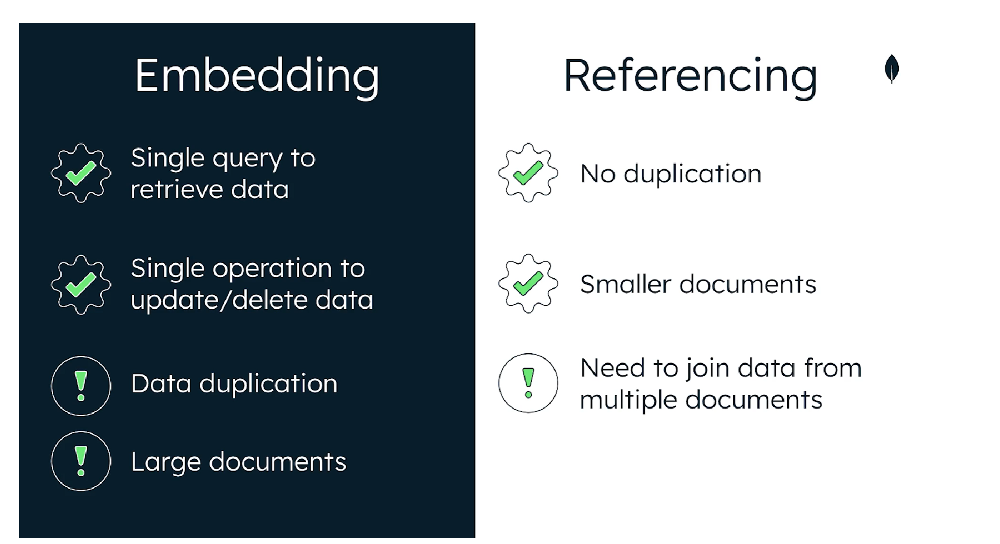

# mongodb-learning-path
This repo is for me to learn mongodb with mongodb university (https://learn.mongodb.com/)

# Creating and Deploying Atlas Cluster
1. Organizations
- allow to group and define users and terms
- grant access to projects

2. Projects
- allow to define and organize resources (such as database cluster)
- we can create separate projects for development, testing and production

## Setting up cluster using cli
> atlas setup --clusterName myAtlasClusterEDU --provider AWS --currentIp --skipSampleData --username myAtlasDBUser --password myatlas-001 | tee atlas_cluster_details.txt

Organization name: "MY_MDB_ORG"
Project name: "MDB_EDU"
Cluster name: "myAtlasClusterEDU"
Database user: "myAtlasDBUser"
Password: "myatlas-001"
Permissions: "readWriteAnyDatabase"

## loading sample dataset
> atlas clusters sampleData load myAtlasClusterEDU

# MongoDB Database
- In this section, we will learn about how MongoDB is classified and commonly used
- How data is organized
- How MongoDB relates to Atlas

1. It is a general purpose document database
    - it structures data into documents (similiar to JSON object)
2. Document Model
    - easier to plan how application data will correspond to data in the database
    - can model data of any shape or data structure
    - document can model everything from key value pair, text, geospatial, time-series, graph data and more
    - we can use one format for any application

## Terms
1. Document
    - The basic unit of data in MongoDB
2. Collection
    - A grouping of documents
    - the documents do not have to have the same structure as MongoDB provides flexible model
3. Database
    - A container for collections

Relationship with Atlas
- The MongoDB Database is at the core of Atlas

# MongoDB Document Model
- the data is displayed in JSON but actualy it is stored in BSON (which is extension of JSON)
- BSON (Binary JSON) is a binary representation of JSON-like documents. It's used primarily by MongoDB to store and transfer data in a way that's both efficient and flexible. BSON extends the JSON data model to provide **additional data types**, such as int, long, date, floating point, and binary, that are not available in standard JSON.
- Every document requires an _id field, which act as a primary key
- If an inserted document doesn't include the _id field, MongoDB automatically generates an ObjectId for the _id field
- Documents may contain different fields, and fields may contain different types
- if we want to have a new field, just simply update the document with new field
- we can have optional schema validation as well, to set constraints on the structure of documents

# Data Modeling
- Data Modeling is the process of defining how data is stored and relationship that is among different entities
- When modeling, we can ask some questions:
1. What does my application do?
2. What data will I store?
3. How will users access this data?
4. What data will be most valuable to me?

- By asking these questions, you will know:
1. your tasks as well as those users
2. What your data looks like
3. The relationships among the data
4. The tooling you plan to have
5. The access patterns that might emerge

- Having a good data model can:
1. Make it easier to manage data
2. Make queries more efficient
3. Use less memories and CPU
4. reduce costs

Principle of MongoDB:
1. Data that is accessed together should be stored together
2. But, we can also normalize our data by using database references

# Types of data relationships in mongodb
1. One-to-One
2. One-to-many
3. Many-to-many

## Ways to model relationships
1. embedding
2. referencing

- in general, we should structure our data to match the ways that our application queries and updates it

  

# Scaling Data Model
Optimum efficiency of:
1. query result times
2. memory usage
3. cpu usage
4. storage

Firstly, we need to avoid unbounded documents where docuements that grow infinitely

Problems as infinite array (posts that have infinity comments):
1. It will takes up more space in memory
2. may impact write performance
3. difficult to perform pagination of comments
4. maximum document size of 16MB will lead to storage problems

# Schema anti-patterns problem
1. Sub-optimal performance
2. Non-scalable solutions

## Common Schema anti-patterns
1. Massive arrays
2. Massive number of collections
3. bloated documents
4. unnecessary indexes
5. queries without indexes
6. data that accessed together but stored in different collections